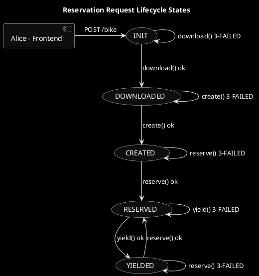

# Lifecycle Of A Custom Bike Request
[bicycle](https://asciiart.website/index.php?art=transportation/bicycles)
```textmate
              __
   ,--.      <__)
   `- |________7
      |`.      |\
   .--|. \     |.\--.
  /   j \ `.7__j__\  \
 |   o   | (o)____O)  |
  \     /   J  \     /
   `---'        `---'      hjw
```


An custom bicycle request starts with Alice issuing a `POST` to the service's `/bike` endpoint.
An identifier for her request for a bike will be returned in the HTTP response to her immediately.
Her desired bike is the result of a detailed blueprint provided by Alice and then realized by the service.
Alice specifies in the HTTP entity the exact immutable locations of certain documents (instructions, bill of material,
mechanical information and sources, etc). Those documents are supposed to exist in some repository, like for example
Github.

Notice that one custom bike equals another if the blueprint is the same. If we have immutable documents, like the ones
specified with [NI-URI](https://tools.ietf.org/id/draft-hallambaker-decade-ni-params-01.html) then it is easy to 
determine if two bikes are the same or not. About Named Information URIs, see:
* [trusty URIs](https://books.google.com/books?id=pbT0AwAAQBAJ&pg=PA395&lpg=PA395&dq=how+to+identify+immutable+resources+on+the+web&source=bl&ots=kPGoSpEj5d&sig=ACfU3U0Xgya6q4F2eUKq7-ah0y-XsGKaHg&hl=en&sa=X&ved=2ahUKEwiE-7vJ5JfnAhXKPn0KHdt5CvIQ6AEwDnoECAoQAQ#v=onepage&q=how%20to%20identify%20immutable%20resources%20on%20the%20web&f=false)
* [immutable data services](https://rigsomelight.com/2013/06/17/immutable-data-service.html)

Once the _request_ is issued, if it passes validation, the service responds immediately 
accepting it (202 `ACCEPTED`) for later processing.
Part of the validation is to check if the NI-URI are well formed (determine if documents are really immutable). An NI-URI
looks like this:
```
ni://github.com/myrepo/sha-1;B_K97zTtFuOhug27fke4_Zgc4Myz4b_lZNgsQjy6fkc
```

A simplified diagram of the state machine representing a bike request is:



See [here](fsm.puml) for the actual FSM, and [here](sequence_diagram.puml) for a sequence diagram.

[Class dependencies](class_dependencies.puml)